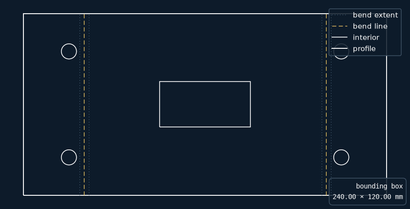

# Coons DXF Viewer

A small DXF viewer for people who just want to *look at* a DXF without
installing a CAD suite or trusting a random web upload. White linework on a dark
background, and it understands Fusion 360 sheet-metal flat patterns: bend lines
are drawn dashed, bend extents faint and dotted.

Named for [Steven Coons](https://en.wikipedia.org/wiki/Steven_Anson_Coons),
whose surface patches helped turn CAD from drafting automation into real
geometric modelling.



## Install

```
pip install ezdxf matplotlib
```

## Use

```
python coons.py                 # opens a file picker
python coons.py drawing.dxf     # opens that file
```

On Windows you can also drag a `.dxf` onto `coons.bat`.

### Open .dxf files by double-clicking (Windows)

```
python install_association.py
```

That registers a `Coons.DXFViewer` ProgID under `HKEY_CURRENT_USER` — per-user,
no admin, and undoable with `--uninstall`. It deliberately does *not* seize the
default association: Windows guards the default app behind a hashed `UserChoice`
key that only the shell may write. Finish the job once by hand:

> right-click any `.dxf` → **Open with** → **Choose another app** →
> **Coons DXF Viewer** → tick *Always use this app*

It launches through `pythonw.exe`, so there's no console window flash.

## Controls

| key / input | action |
|---|---|
| scroll wheel | zoom at cursor |
| drag | pan (the matplotlib toolbar works too) |
| `e` | show/hide bend-extent construction lines |
| `b` | cycle background: navy → black → dark grey |
| `l` | show/hide legend and bounding-box readout |
| `r` | reset view |
| `q` | quit |

## Layer styling

Entities are styled by layer name, matched case-insensitively against the
`LAYER_STYLES` table in `coons.py` — first pattern wins, and anything
unrecognised falls through to solid white. The defaults target Fusion 360's
flat-pattern export:

| layer | style |
|---|---|
| `OUTER_PROFILES` | solid white |
| `INTERIOR_PROFILES` | solid white, thinner |
| `BEND` | dashed amber |
| `BEND_EXTENT` | faint dotted, toggleable with `e` |

If your exporter names layers differently, add a row to `LAYER_STYLES`.

## Bounding box

The readout in the bottom-right is the overall size of the real geometry —
construction layers (anything marked `optional`) are excluded so they can't
inflate it. Units come from the file's `$INSUNITS` header, so a Fusion export in
millimetres reports millimetres.

## License

MIT
